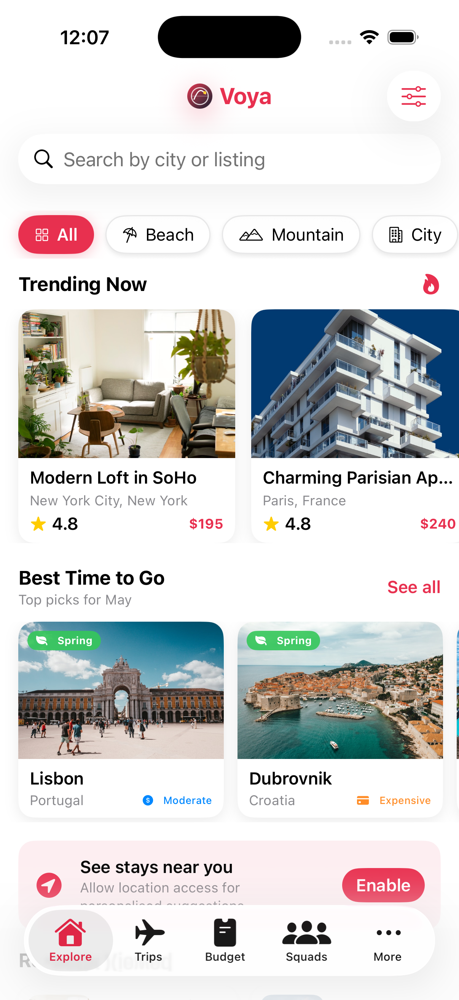
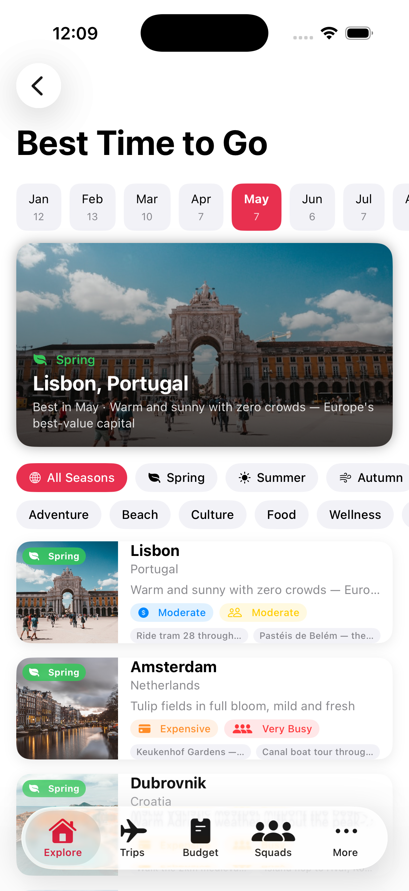
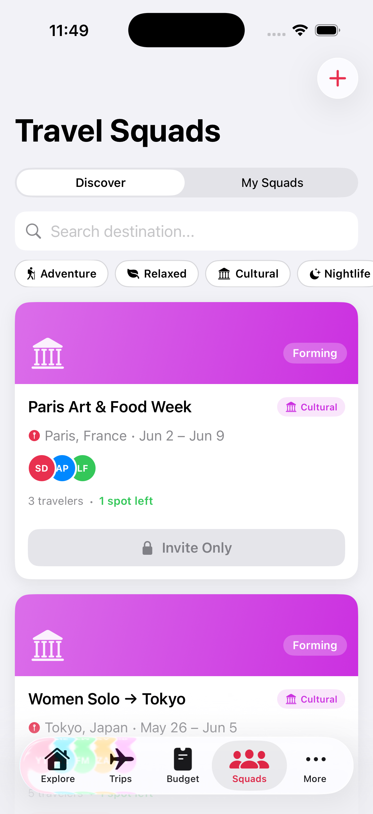
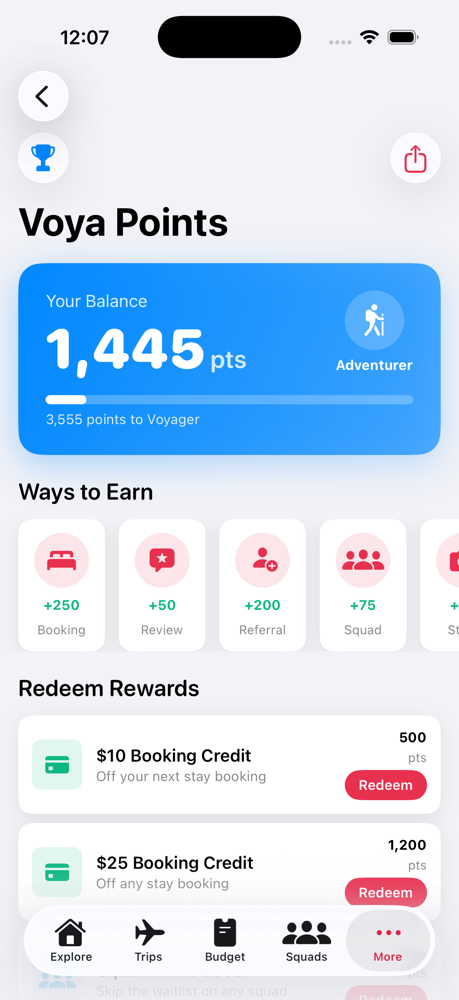
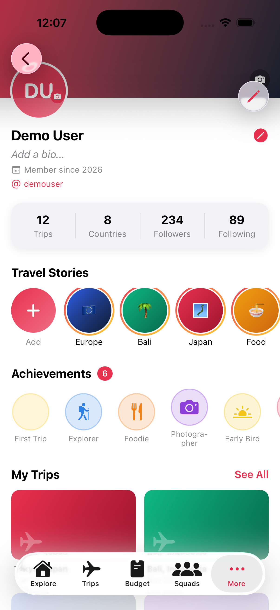
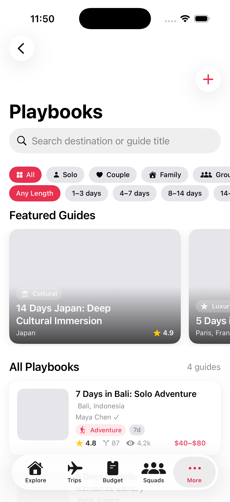

# Voya — Travel Companion App

A full-featured iOS travel companion app built with SwiftUI, following strict MVVM architecture. Voya helps travellers explore stays, plan trips, manage budgets, join travel squads, and earn rewards — all in one place.

---

## Screenshots

| Explore | Best Time to Go | Squads |
|---------|----------------|--------|
|  |  |  |

| Rewards | Profile | Playbooks |
|---------|---------|-----------|
|  |  |  |

---

## Features

### Explore
- Trending stays ranked by Wilson score (rating × log reviews)
- Smart search with 300ms debounce and full-text ranking
- Filter sheet: price cap, minimum rating
- Category chips: All, Beach, Mountain, City, Cabin, Villa, Boutique
- Price analysis badges: Great Value, High Demand, Luxury
- Recently viewed with local persistence
- Distance badge on every card once location is granted

### Near Me
- CoreLocation integration with reverse geocoding
- "See stays near you" permission banner
- Horizontal scroll of stays within 2,000 km sorted by distance

### Best Time to Go — Seasonal Recommendations
- 36 destinations across all 12 months and all 4 seasons
- 12-month selector showing destination count per month
- Filters by season (Spring / Summer / Autumn / Winter) and trip style
- Full detail: weather, temp range, price tier, crowd level, festivals, highlights, travel tip

### Budget Planner
- Build a trip budget category by category: flights, stay, food, transport, activities, visa, insurance, shopping, emergency
- Three tiers per category: Budget / Comfortable / Splurge
- Friend Stay Mode: toggle staying with a local friend and see accommodation savings
- City cost-of-living autocomplete — type a destination and get daily spend estimates + a travel tip
- Per-person and total summary

### Travel Stories
- Instagram-style stories with 24-hour expiry
- Gradient ring indicators for unviewed stories
- 5-second auto-advance with tap zones for previous/next
- Like, view count, verified badge support
- Add your own story with destination, caption, trip type, and image

### Squads — Group Travel
- Discover and join verified travel squads around shared destinations
- Flash squads with countdown timers
- Women-only squads toggle
- In-squad chat with sent/received bubbles
- Squad creation: name, destination, dates, style, max members
- Travel styles: Adventure, Relaxed, Cultural, Party, Budget, Luxury

### Playbooks — Expert Travel Guides
- Fork a playbook to clone and customise it
- Day-by-day itinerary with activities, types, and durations
- Packing list with checkmarks
- Travel tips with upvotes
- Add your own tips
- Featured ranking: rating × log(view count)

### Voya Rewards
- Earn points for bookings (250), reviews (50), squad joins (75), referrals (200), story posts (30), playbook forks (40), trip completions (300)
- 4 tiers: Explorer → Adventurer → Voyager → Globetrotter with escalating multipliers
- Redemption store: booking credits, squad boosts, lounge passes, premium access
- Full transaction history

### Profile
- Instagram-style layout: cover photo, avatar, bio, stats
- Stats row: Trips, Countries, Followers, Following
- Travel story highlights (persistent collections)
- Achievement badges: First Trip, Explorer, Foodie, Photographer, Early Bird, Squad Leader
- My Trips 2-column grid
- Appearance toggle: System / Light / Dark (persisted)

### Auth
- Splash screen with Voya logo animation
- Onboarding slides
- Email/password login and sign-up
- Biometric lock (Face ID / Touch ID) via LocalAuthentication
- Forgot password flow

---

## Architecture

```
TravelCompanion/
├── Models/              # Codable structs — Stay, User, TravelBudget, Playbook, TravelSquad…
├── Services/            # @MainActor ObservableObject singletons with UserDefaults persistence
├── ViewModels/          # @MainActor ObservableObject, Combine pipelines, zero UIKit
├── Views/
│   ├── Auth/            # Splash, Onboarding, Login, SignUp, BiometricLock
│   ├── Budget/          # BudgetView, BudgetPlannerView, BudgetDetailView
│   ├── Components/      # StayCardView, SeasonalCard, RatingBadge, PriceBadge…
│   ├── Playbooks/       # PlaybooksView, PlaybookDetailView, CreatePlaybookView
│   ├── Points/          # PointsView, TierBenefitsView
│   ├── Profile/         # ProfileView, EditProfileView, SecuritySettingsView…
│   ├── Seasonal/        # SeasonalView, SeasonalDetailView
│   ├── Social/          # StoriesBarView, StoryDetailView, AddStoryView
│   ├── Squads/          # SquadsView, SquadCardView, SquadDetailView, CreateSquadView
│   └── Trips/           # TripsView, TripDetailView
└── Utils/               # AppTheme, Extensions, HapticService
```

**Pattern:** Models → Services → ViewModels → Views. Zero business logic in views. All async via `@MainActor` and Combine.

---

## Design System

Defined in `Utils/AppTheme.swift`:

- **Brand**: Coral red `#E8304F`, deep navy `#0F1A2E`, amber gold `#FFCC2E`
- **Adaptive surfaces**: `UIColor.systemBackground` — works in light and dark mode
- **Typography**: SF Rounded scale from `largeTitle` (34pt bold) to `caption` (12pt)
- **Spacing**: 4 / 8 / 12 / 16 / 20 / 24 / 32 / 48
- **Radius**: sm:8 / md:12 / lg:16 / xl:20 / pill:999
- **VoyaLogoView**: SwiftUI globe + flight arc + destination pin component
- **Modifiers**: `.cardStyle()`, `.primaryButton()`, `.secondaryButton()`, `.chipStyle()`

---

## Tech Stack

| Layer | Technology |
|-------|------------|
| UI | SwiftUI |
| State | Combine + `@Published` |
| Async | Swift Concurrency (`async/await`, `@MainActor`) |
| Persistence | UserDefaults + JSONEncoder/Decoder |
| Location | CoreLocation + CLGeocoder |
| Biometrics | LocalAuthentication |
| Images | Custom `AsyncCachedImage` with NSCache |
| Architecture | MVVM (strict — zero logic in views) |
| Min target | iOS 17 |
| Language | Swift 5.9 |

---

## Getting Started

1. Clone the repo
   ```bash
   git clone https://github.com/Kaustubha-09/voya.git
   ```

2. Open in Xcode
   ```bash
   open TravelCompanion.xcodeproj
   ```

3. Select the **TravelCompanion** scheme and an iPhone simulator (iOS 17+)

4. Press **⌘R** to build and run

> No dependencies, no CocoaPods, no SPM packages — pure Apple frameworks only.

---

## Mock Credentials

| Field | Value |
|-------|-------|
| Email | `demo@voya.app` |
| Password | `password123` |

---

## Project Stats

- **100** Swift source files
- **~14,000** lines of code
- **0** third-party dependencies
- **11** feature modules
- **40+** city cost-of-living presets
- **36** seasonal destination recommendations

---

## Roadmap

- [ ] Android app (Jetpack Compose)
- [ ] Web app (Next.js)
- [ ] Real backend (Supabase / Firebase)
- [ ] Live squad chat (WebSockets)
- [ ] Map view for stays and squads
- [ ] Push notifications
- [ ] App Store submission

---

## License

MIT
